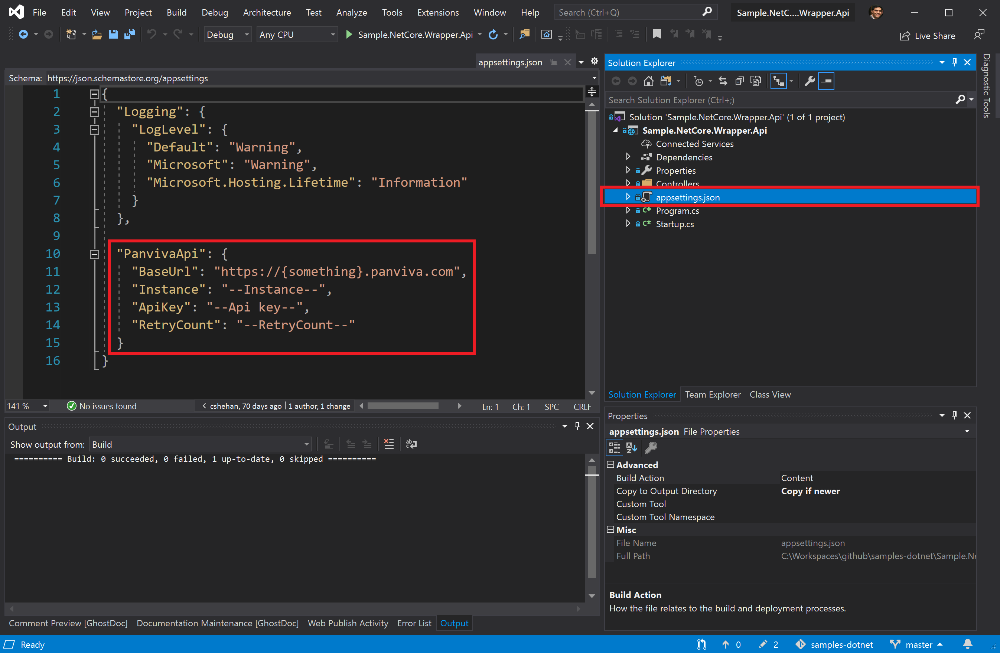

# .Net Samples

These samples allow you to push your knowledge further and consume a complete list of Panviva's API offerings using [Panviva's DotNet Toolkit](https://www.nuget.org/packages/Panviva.Sdk.Services.Core/).

The samples below will consume:

`Content APIs` perform resource related operations , e.g. document, folder, file, container, image.

`Live APIs` enable real-time communications with online users on our client application.

`Artefact APIs` interact with curated Panviva content, created by the Digital Orchestrator.

## **Prerequisites**

### To use this, you must have:

1. Access to a Panviva instance (also known as a tenant)
2. A developer account on the Panviva developer portal ([dev.panviva.com](https://dev.panviva.com))
3. An active Panviva API subscription (also known as an API plan) and valid Panviva API credentials

If you are not a customer or need help visit [www.panviva.com/support](https://www.panviva.com/support).

### How to get credentials

Follow the steps below to get your `API key` & `instance name`.

To get your API key you must:

1. Sign into the Panviva developer portal at [dev.panviva.com](https://dev.panviva.com)
2. Navigate to your profile (click your name then click "Profile" from the top navigation bar)
3. Your should now see your API key under "Your Subscriptions" section of your profile.

To get your instance name you must:

1. Sign into the Panviva developer portal at [dev.panviva.com](https://dev.panviva.com)
2. Navigate to your API (click "APIs" from the top navigation bar)
3. You should now see your API instance under your API suite (look for "_The instance name for the API Suite is_")

### Other requirements

- ASP.Net Core Runtime sdk 3.1 or grater

### Configure your Sample

Use your Panviva credentials from the aforementioned steps & configure your samples to use them like so:

1. Your `BaseUrl` should be `https://api.panviva.com`
1. Set `Instance` to the `instance name` gathered in the aforementioned steps
1. Set `ApiKey` to the `API key` gathered in the aforementioned steps
1. Set `RetryCount` to a value that works for you. Eg. `"RetryCount": "3"`

## Samples

| #   | Sample Name                        | Description                                                                                                                                                                                            | API Type                               | Link                                                                 |
| --- | ---------------------------------- | ------------------------------------------------------------------------------------------------------------------------------------------------------------------------------------------------------ | -------------------------------------- | -------------------------------------------------------------------- |
| 1.  | GetDocument.Direct.Api (Sample No. 1)             | A simple .Net Core API to show how to get and combine the metadata and content of a document from Panviva's APIs, utilizing `GET Document` , `GET Document Containers` and `GET Document Translations` | Content APIs                           | [LINK](Samples.NetCore.GetDocument.Direct.Api/README.md)             |
| 2.  | GetDocument.ConsoleApp (Sample No. 2)             | A simple .Net Core Console App to show how to get the metadata and content of a document from Panviva's APIs, utilizing `GET Document` and `GET Document Containers`                                   | Content APIs                           | [LINK](Samples.NetCore.GetDocument.ConsoleApp/README.md)             |
| 3.  | GetDocument.AsPlainText.ConsoleApp (Sample No. 3) | A simple .Net Core Console App to show how to get the metadata and content of a document from Panviva's APIs, utilizing `GET Document` and `GET Document Containers` as plain-text                     | Content APIs                           | [LINK](Samples.NetCore.GetDocument.AsPlainText.ConsoleApp/README.md) |
| 4.  | GetDocument.Updated.ConsoleApp (Sample No. 4)     | A simple .Net Core Console App to show how to get a list of documents recently updated from Panviva's APIs, utilizing `GET Search`                                                                     | Content APIs                           | [LINK](Samples.NetCore.GetDocument.Updated.ConsoleApp/README.md)     |
| 5.  | Wrapper.Api (Sample No. 5)                       | A simple .Net Core API to show how to use Panviva .Net SDK to `GET` and `POST` content to Panviva's APIs, Utilizing number of Panviva API endpoints                                                    | Content APIs, Live APIs, Artefact APIs | [LINK](Sample.NetCore.Wrapper.Api/README.md)                         |
| 6.  | Samples.Net.Web (Sample No. 6)                    | A simple .Net 5 and React Web Application that allows you to search and display panviva documents.                                                                                                     | Content APIs, Artefact APIs, Live APIs | [LINK](Samples.Net.Web/README.md)                                    |
| 7.  | Samples.Net.Artefacts.Web (Sample No. 7)                    | A simple .Net 5 and React Web Application that allows you to search and display panviva artefacts.                                                                                                     | Artefact APIs | [LINK](Samples.Net.Artefacts.Web/README.md)         
