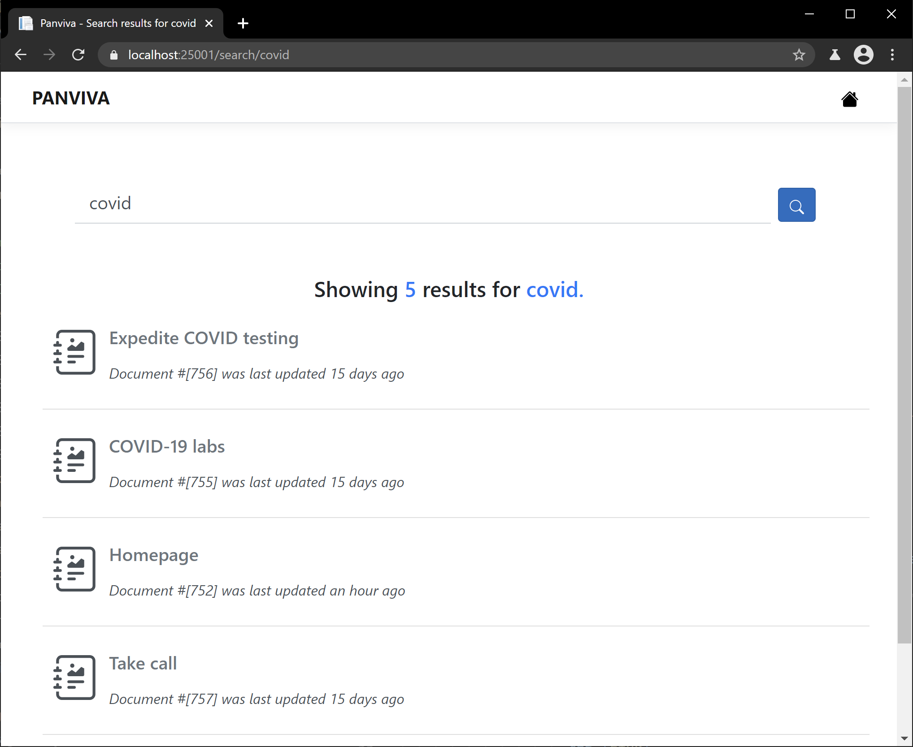

# Samples.Net.Web

A simple `.Net 5` and `React` Web Application that allows you to search and display panviva documents.

Following Endpoints are exposed via APIs.

- `GET Search`
- `GET Search Artefacts`
- `GET Document Containers`
- `GET Document Containers Relationships`
- `GET Image`
- `GET File`
- `POST Live CSH`
- `POST Live Search`
- `POST Live Document`

## Prerequisites

### Configure Application

- You will require `instance name` and `API key` from the [previous instructions](../README.md#how-to-get-credentials)

- Change Directory into the `Samples.Net.Web` folder from where this README is contained.

- Entered the acquired credentials in the configuration file (`appsettings.json`)

## Running the Application

```bash
# Assuming you've installed .net runtime SDKs in your environment and you are in correct directory
# run this command in bash
dotnet run
```

## Using the Application

You should be able to interact with the application at [https://localhost:25001/](https://localhost:25001/)





> Note: You can check the debug button to view json payloads on the webpage.
